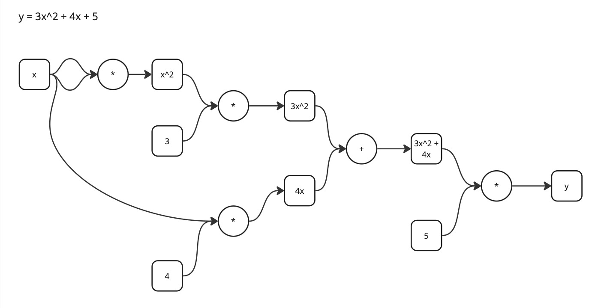
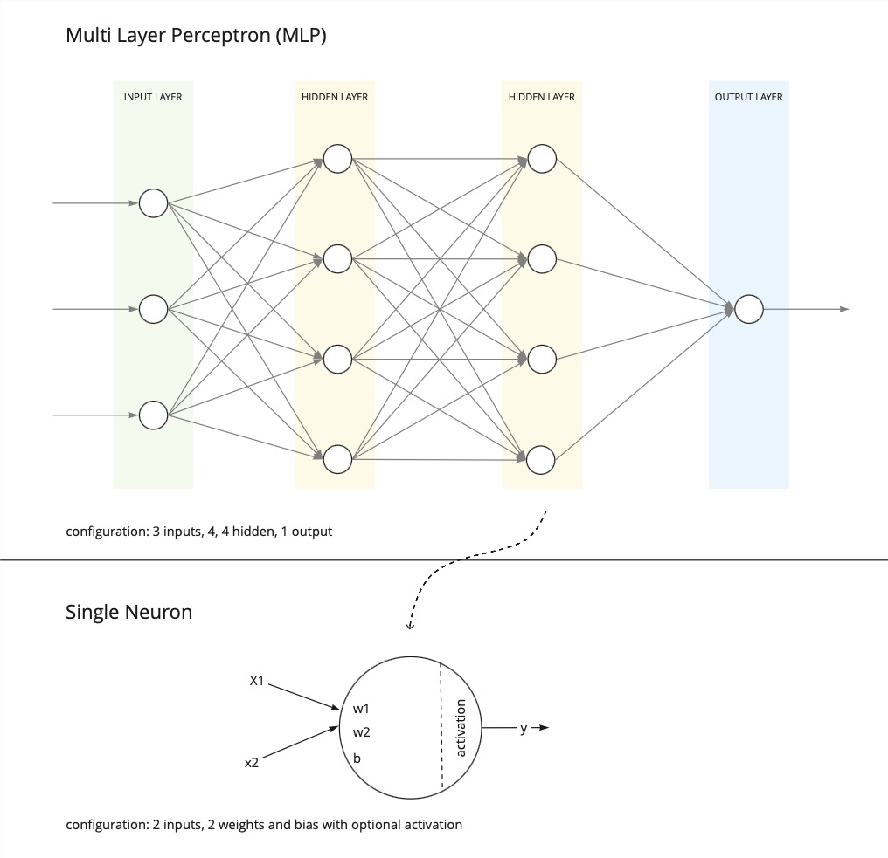

# kotlin implementation of micrograd library

[micrograd](https://github.com/karpathy/micrograd) is a tiny autograd engine. This is a kotlin implementation of the library for learning purposes.

## Learning

For visual learners, follow the youtube video [building micrograd](https://www.youtube.com/watch?v=VMj-3S1tku0).

### Value

[Value](./src/main/kotlin/Engine.kt) can be used to create a computational graph which support backpropagation.



### MLP

[MLP](./src/main/kotlin/NN.kt) builds on a Value to create a simple neural network from a Neuron to Layer to an MultiLayerPerceptron (MLP).



## Running

java 21 is a prerequisite.

```shell
./gradlew test
```

See [tests](./src/test/kotlin/) for examples.
